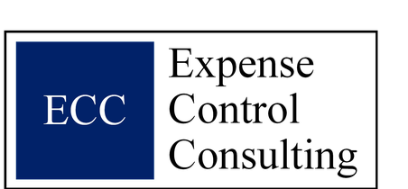

# Expense Control Consulting Website

This is your full website. It is plain HTML, CSS, and JavaScript.
No WordPress needed. It works on GitHub Pages for free.

## Important: GitHub Pages and public visibility

The free version of GitHub Pages requires your repository to be
public. That means anyone could view the raw HTML, CSS, and
JavaScript source code for this site if they went looking for it on
GitHub, the same way they could already view the source code of any
website by right clicking and choosing "View Page Source" in a
browser.

This is normal for a basic business website like this one. There is
nothing sensitive in this code, no passwords, no database
connections, no private client data. The only thing worth knowing is
that the small bits of JavaScript on the Contact page (the phone and
email reveal buttons) are visible in the source if someone looks for
them, which is also true of practically every public website.

If you ever want the source code itself to be private, GitHub
requires a paid plan (GitHub Pro or higher) to host Pages from a
private repository. For a simple site like this, it is usually not
worth the cost, but it is good to know the option exists.

## Files

- index.html = Home page
- what-we-do.html = Services (Uniforms, Garbage, Construction, Freight)
- how-we-do-it.html = How We Do It (5 step process, scope can flex)
- who-we-are.html = About the firm
- the-ecc-edge.html = Custom Software and Customer Service cards
- sustainability.html = Environmental results (green theme)
- contact.html = Phone and email, both click to reveal, no LinkedIn here
- css/style.css = all the styling (colors, fonts, layout)
- js/main.js = the mobile menu behavior
- images/logo-full.png = your full logo (navy ECC box plus text), used in the navbar on every page
- images/uniforms.jpg, garbage.jpg, construction.jpg, freight.jpg =
  your real service photos, already placed in the What We Do cards

## Comments in the code

Every HTML file starts with a comment block explaining what that
page is for. Inside each file, comments like this mark each section:

  <!-- ============ SECTION NAME ============ -->

These comments are not visible to website visitors, they are only
visible if you open the file in a code editor like VS Code. Use them
to quickly find the part of the page you want to change.

The CSS file (css/style.css) has the same kind of comments, plus a
"QUICK EDITING GUIDE" note right at the top of the file.

## Colors

Navy (text and footer): #012169
Light blue (main accent): #4A8FE0
Pale blue (backgrounds): #F5F9FE and #EAF2FD
Gold (rare accent): #B1997B
Green (sustainability page only): #3E8E5A

Accent colors (used on category icons and card borders for variety):
Coral (Uniforms): #E8734A
Teal (Garbage): #2BA8A0
Amber (Construction): #E0A92E
Purple (Freight): #7A6FD0

All of these are set once at the top of css/style.css, inside the
:root block. Change a value there and it updates everywhere on the
site that uses it.

## Contact page: spam protection

Both your phone number and your email are hidden behind a button on
the Contact page. Nothing is written into the page as visible text
until a visitor clicks to reveal it. The LinkedIn icon was
intentionally removed from this page and only appears in the footer.

Honest limit: this is not a guarantee against all spam, just
protection against basic bots that scan a page's raw visible text.
There is no code trick that makes a public phone number or email 100
percent unreachable once a real person can see it, and since the
site's source code is public on GitHub (see note above), a bot
specifically built to read JavaScript could still find both.

## LinkedIn

Your LinkedIn company page is linked in the footer on every page,
including the Contact page's footer.
https://www.linkedin.com/company/expense-control-consulting

## Service photos

The What We Do page cards use your real photos:
images/uniforms.png, images/garbage.png, images/construction.png,
images/freight.png. Each photo sits in a 140x140 pixel box and is
shown in full (not cropped), with a light blue background filling
any empty space around it. To swap any of these for a different
photo:

1. Save the new photo into the images folder
2. Open what-we-do.html
3. Find the matching line, for example:

   

4. Change the file name to your new photo

## How to add photos elsewhere

1. Save your photo into the images folder
2. Add an image tag where you want it, for example:

   

## How to update your logo

Your real logo is already in use. If you ever want to swap it for a
new version:

1. Save the new file into the images folder
2. Open every HTML file
3. Find this line near the top of each page:

   

4. Change "images/logo-full.png" to your new file name

## Google Analytics and Microsoft Clarity

Both tracking codes are already installed on every page (near the top,
inside the <head> section). Google Analytics uses tag G-RTKHVCG90G and
Microsoft Clarity uses project xa82pijym0. There is nothing more to do.
If you ever need to change a tracking code, find the matching script
block near the top of each HTML file and swap in the new one. Remember
to do it on all 7 pages, or some pages will not be tracked.

## How to put this on GitHub Pages

1. Create a free GitHub account if you do not have one
2. Create a new repository
3. Upload all these files and folders into it, keeping the same folder structure
4. In the repository settings, turn on GitHub Pages
5. Point your custom domain (expensecontrolconsulting.com) to GitHub Pages
   in your domain settings at Microsoft
6. GitHub has a help page that walks through the domain connection step
   if you get stuck
